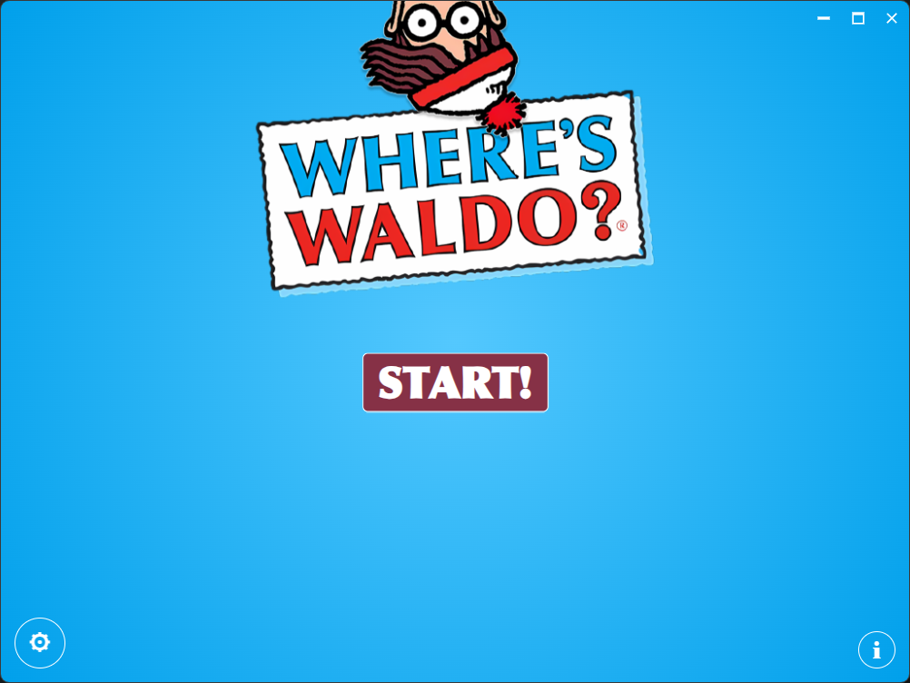
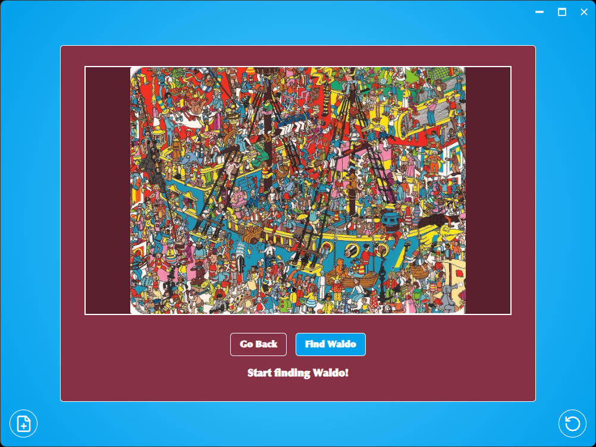
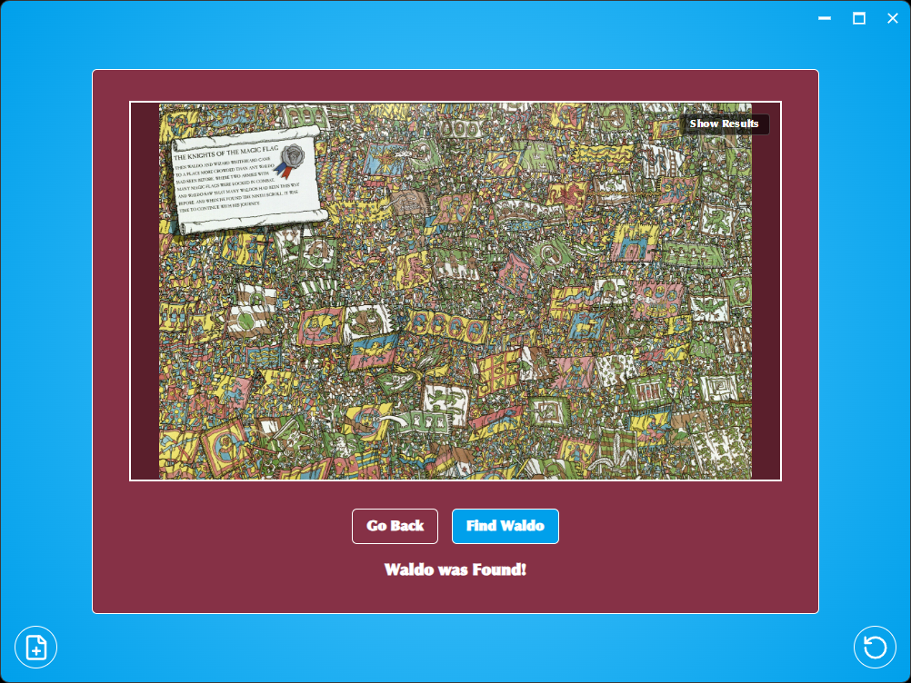
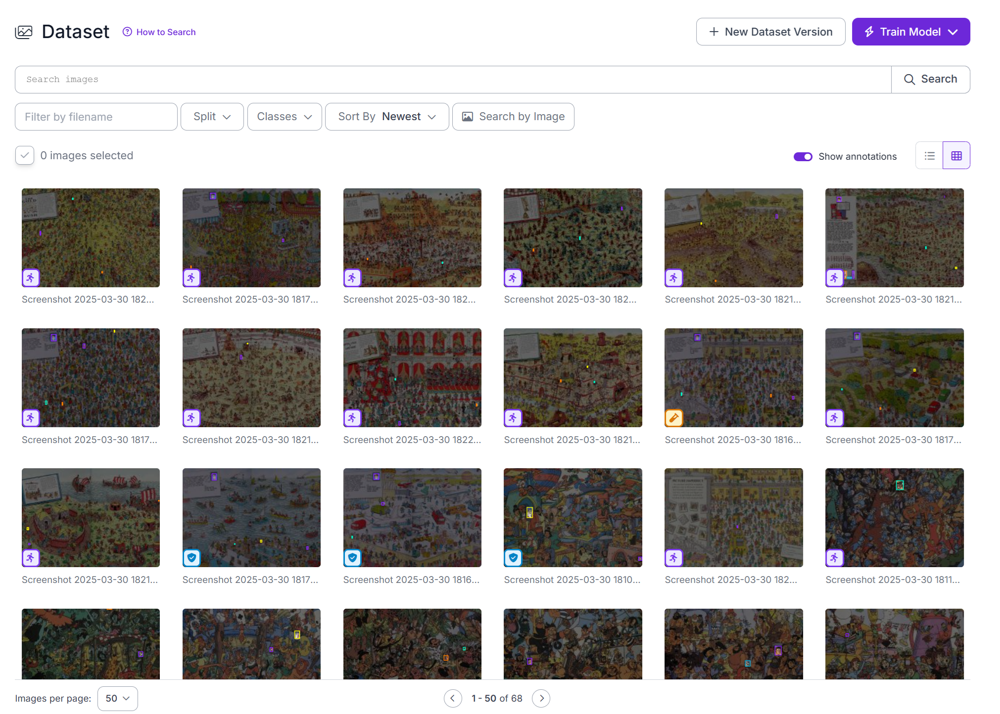

<h1 style="font-family: Arial, sans-serif; font-size: 36px; color: #4A90E2; display: flex; align-items: center; border-bottom: 3px solid #4A90E2; padding-bottom: 5px;">
    
    Waldo Finder! 🌟
</h1>
Waldo Solver is a fast, privacy-first, AI-powered desktop app that helps you find Waldo in images using advanced computer vision models. Built for speed, simplicity, and local intelligence.

> Runtime update: the app now uses a TypeScript inference pipeline instead of the old Python server, so users no longer need to bundle Python or manage extra runtime dependencies.

---

## Tech Used 🧑‍💻


---

## Core Features ⚡

* 🖼️ **AI-Powered Waldo Detection:**  
    Uses local computer vision models to find Waldo in your images.

* 🔍 **Offline Processing:**  
    All detection runs locally. No internet required, no data leaves your device.

* 📂 **SUPER FREAKING FAST:**  
    Select and process your images at the speed of light, with live progress tracking.

* 📂 **Multi Objects classification:**  
    Can differentiate between Waldo and all of his friends and family! ( I assume they are, is there a lore to this?)

* 🎨 **Modern UI:**  
    Responsive, clean interface built with SolidJS and TailwindCSS.

* 💻 **Cross-platform Desktop App:**  
    Powered by Tauri for lightweight, native performance on Windows, macOS, and Linux.

* ⚙️ **Configurable Settings:**  
    Adjust detection sensitivity, timeout, and save location.

---

## Screenshots 📸

<br>


**Project showcase:** Snappy, Modern, Relible, and VERY Accurate! 🌟

<br>


**Hello Screen:** Welcome screen with animated logo and quick access to start detection.

<br>


**File Picker:** Select images for Waldo detection with a modern, easy-to-use dialog.

<br>


**Loading Screen:** Real-time progress bar and status while processing images.

<br>



**Main Detection Screen:** View and interact with the image being analyzed for Waldo.

<br>



**Solved Screen:** See the detected Waldo location highlighted on your image.

<br>


**Blur Solution:** Privacy-focused preview with sensitive regions blurred until revealed.

<br>


**Settings Screen:** Configure detection parameters, timeout, and save location.

<br>


**About Screen:** Learn more about the app, its features, and its privacy-first approach.

---

## Models Used 🧠

> All models run **locally** and are optimized for performance.

| Model        | Purpose                      | Notes |
|--------------|-----------------------------|-------|
| **YOLOv12**   | Object detection (Waldo)    | Fast, accurate, runs locally |
| **Custom Waldo Dataset** | Trained for Waldos detection | Improves accuracy on challenge images |

- The training wasn't straightforward, as you can see you can't just train a model on these beefy huge images, so I had to be ... creative :^)
---

## Dataset 📂

I BUILT MY OWN DATASAET
BY SPENDING DAYS OF MY LIFE SOLVING A KIDS BOOK SERIES
- I shouldn't say it that way but who cares
- link if you're interested : [Dataset](https://app.roboflow.com/mohaneds-workspace/where-s-waldo-zu227/8)



**Dataset:** uses a 68 Super high resolution hand solved Waldo spreads.

---

## Project Structure

```plaintext
/ (root)
├── README.md              # This file.
├── package.json           # Node dependencies and scripts.
├── tsconfig.json          # Typescript configuration.
├── vite.config.ts         # Vite configuration.
├── public/                # Public assets (logo, etc.).
├── screenshots/           # Application screenshots.
├── src/                   # SolidJS source code.
│   ├── App.css            # App level styles.
│   ├── App.tsx            # Main App component.
│   ├── components/        # Reusable UI components.
│   ├── hooks/             # Custom hooks.
│   ├── routes/            # Application pages.
│   ├── utils/             # Utility functions.
│   └── main.tsx           # Application entry point.
└── src-tauri/             # Tauri integration (Rust backend).
```

---

## Setup and Development 🛠️

1. **Prerequisites:**  
   - Node.js (v18+), pnpm, Rust, and Tauri CLI.

2. **Install Dependencies:**  
   ```sh
   pnpm install
   ```

3. **Run in development:**
    ```sh
    pnpm start
    ```

4. **Build production assets:**
    ```sh
    pnpm build
    ```

5. **Use the installer:**
    - From the releases section on windows, for other installers you can build on your machine.

---

## Recommended IDE Setup 💻

* [VS Code](https://code.visualstudio.com/)
* [Tauri for VS Code](https://marketplace.visualstudio.com/items?itemName=tauri-apps.tauri-vscode)
* [rust-analyzer](https://marketplace.visualstudio.com/items?itemName=rust-lang.rust-analyzer)

---

## Contributing 👥

Contributions are welcome!  
If you find a bug, have a feature request, or want to improve the codebase, feel free to:

1. Open an issue to discuss the change.
2. Fork the repository.
3. Create your feature branch (`git checkout -b feature/AmazingFeature`).
4. Commit your changes (`git commit -m 'Add some AmazingFeature'`).
5. Push to the branch (`git push origin feature/AmazingFeature`).
6. Open a Pull Request.

---

## Roadmap 🗺️

### Phase 1: Core Functionality
- [x] Offline Waldo detection.
- [x] High accuracy model.
- [x] Configurable detection settings.

### Phase 2: Enhanced Features
- [x] Annotated output images.
- [x] Performance and UI improvements.
- [x] Error handling and logging.

## License ⚖️

This project is licensed under a custom License - see the `LICENSE` file for details.

---

## Contact 📬

- GitHub: [mohaneddz](https://github.com/mohaneddz)
- Email: mohaned.manaa.dev@gmail.com

---
