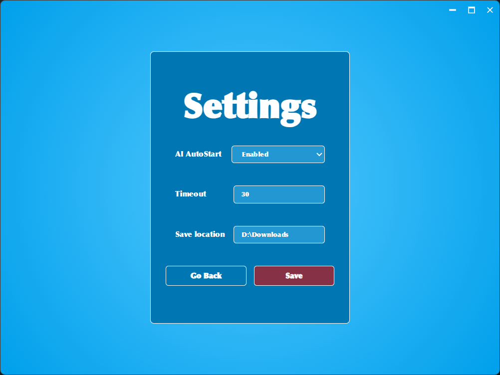
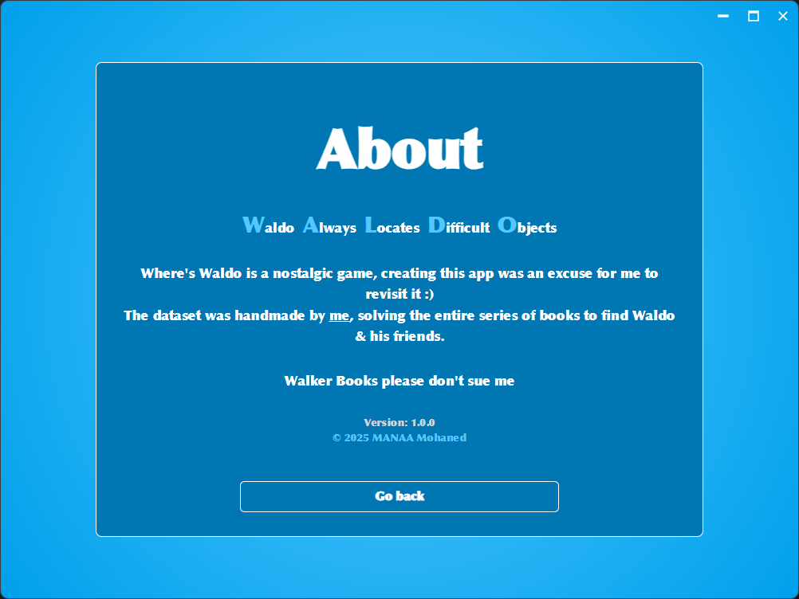

# FanumTAG 【🏷️】

- FanumTAG is a fast, privacy-first, AI-powered image/document captioning and tagging tool for all types of users (especially me).
Built for speed, modularity, and local intelligence.

- As I have thousands of images, documents, that are already organized but still too much to search for
    - **So I'll name the files based on their Keywords, inner text, and important data!**

---

## Tech Used 🧑‍💻


---

## Core Features ⚡

* 🖼️ **Offline AI Captioning:**  
    Auto-caption and tag images, videos, and documents locally. No internet required.

* 🔍 **Advanced OCR:**  
    Extracts text from images in both English and Arabic using EasyOCR.

* 🤖 **Vision-Language Models:**  
    Deep image understanding with SMOLVLM2 and Qwen2-VL for context-aware captions and tags.

* 🏷️ **Keyword Extraction:**  
    KeyBERT integration for smart, relevant keyword generation from documents and captions.

* 📂 **Batch Processing:**  
    Caption and tag hundreds of files in one go, with live progress tracking.

* ✏️ **Smart Renaming:**  
    Automatically rename files based on generated captions or extracted keywords, with validation and duplicate avoidance.

* 📄 **Multi-format Support:**  
    Images (JPG, PNG, BMP, TIFF, GIF, WEBP), Videos (MP4, AVI, MOV, MKV, WMV, FLV, WEBM), Documents (PDF, TXT, DOCX).

* 🖥️ **Modern UI:**  
    Responsive, clean interface built with SolidJS and TailwindCSS.

* 💻 **Cross-platform Desktop App:**  
    Powered by Tauri v2 for lightweight, native performance on Windows, macOS, and Linux.

* 🔒 **Privacy & Security:**  
    No data leaves your device. No cloud dependencies.

---

## Screenshots 📸
<br>


**Home Screen:** Clean, minimal interface for quick access to captioning and tagging.

<br>


**Loading Screen:** Real-time progress bar and status while batch loading the files.

<br>


**Preview Screen:** Preview individual files, alongside their metadata.

<br>


**Progress Screen:** Select files and apply AI-generated names in bulk, with validation and error handling.

<br>



**Settings Screen:** Configure OCR language, caption output, and manage AI models.

<br>



**About Screen:** Information about the application and its purpose (I don't know what I'm doing with my life).


---

## Models Used 🧠

> All models run **locally** and are either **quantized** or optimized for performance on consumer-grade devices.

| Model        | Purpose                          | Notes |
|--------------|----------------------------------|-------|
| **SMOLVLM2** | Vision-Language captioning       | Quantized version, fast & lightweight |
| **EasyOCR**  | Arabic & English OCR             | Open-source, supports multi-language |
| **KeyBERT**  | Keyword extraction from text     | Extracts tags from captions/OCR text |
| **Qwen2-VL** _(optional)_ | Richer vision-language understanding | supported, but not integrated to remain accessible |

---

## ✨ In-Depth Look at Features

FanumTAG is crafted to deliver a seamless and efficient experience. Here's a detailed breakdown of its standout capabilities:

* 🖥️ **Offline AI Processing:**  
    All AI models operate locally, ensuring your data remains private while delivering lightning-fast performance.

* 🌐 **Multi-language OCR Support:**  
    Extract text from images in multiple languages, including English and Arabic, with high accuracy.

* 📂 **Batch File Processing:**  
    Handle hundreds of files simultaneously with robust error handling and real-time progress updates.

* 🏷️ **Intelligent File Management:**  
    Automatically rename files using AI-generated captions or tags, ensuring valid filenames and avoiding duplicates.

* 🎨 **Modern User Experience:**  
    Enjoy a responsive, intuitive interface with live progress tracking, batch actions, and clean design.

* 💻 **Cross-platform Compatibility:**  
    FanumTAG runs natively on Windows, macOS, and Linux, offering a consistent experience across all platforms.

* 🔒 **Privacy-first Design:**  
    No internet connection is required, and no data ever leaves your device, guaranteeing maximum security.

---

## Project Structure

```plaintext
/ (root)
├── README.md              # This file.
├── package.json           # Node dependencies and scripts.
├── tsconfig.json          # Typescript configuration.
├── vite.config.ts         # Vite configuration.
├── public/                # Public assets (logo, etc.).
├── screenshots/           # Application screenshots.
├── src/                   # SolidJS source code.
│   ├── App.css            # App level styles.
│   ├── App.tsx            # Main App component.
│   ├── components/        # Reusable UI components.
│   ├── hooks/             # Custom hooks.
│   ├── routes/            # Application pages.
│   ├── utils/             # Utility functions.
│   └── main.tsx           # Application entry point.
├── backend/               # Python backend (Flask, AI models).
│   ├── qwen.py            # Main Flask server.
│   ├── nlp_utils.py       # NLP and OCR utilities.
│   └── ...                # Other backend files.
└── src-tauri/             # Tauri integration (Rust backend).
```

---

## Setup and Development 🛠️

1. **Prerequisites:**  
   - Node.js (v18+), Python (v3.9+), Rust, Tauri CLI, pip.

2. **Install Dependencies:**  
   ```sh
   npm install
   pip install -r requirements.txt
   ```

3. **Install the AI Models:**
    - [SMOLVLM2 + Vision](https://huggingface.co/HuggingFaceTB/SmolVLM2-256M-Video-Instruct)
        - Place it's files in `/backend/models/SmolVLM2/`
    - The rest will be downloaded by the phython files

    -*This will not be needed in the final version, as the download will be automatic from the downloads page*


4. **Start the Backend:**  
   ```sh
   python backend/app.py
   ```

5. **Start the Frontend (Dev):**  
   ```sh
   npm run dev
   ```

6. **Build Desktop App:**  
   ```sh
   npm run tauri build
   ```

---

## Recommended IDE Setup 💻

* [VS Code](https://code.visualstudio.com/)
* [Tauri for VS Code](https://marketplace.visualstudio.com/items?itemName=tauri-apps.tauri-vscode)
* [rust-analyzer](https://marketplace.visualstudio.com/items?itemName=rust-lang.rust-analyzer)

---

## Contributing 👥

Contributions are welcome!  
If you find a bug, have a feature request, or want to improve the codebase, feel free to:

1. Open an issue to discuss the change.
2. Fork the repository.
3. Create your feature branch (`git checkout -b feature/AmazingFeature`).
4. Commit your changes (`git commit -m 'Add some AmazingFeature'`).
5. Push to the branch (`git push origin feature/AmazingFeature`).
6. Open a Pull Request.

---
## Roadmap 🗺️

Here are the planned features and improvements for FanumTAG:

### Phase 1: Core Functionality
- [x] Offline AI captioning and tagging.
- [x] Multi-language OCR support (English, Arabic).
- [x] Batch processing with live progress tracking.
- [x] Smart file renaming with validation.

### Phase 2: Enhanced Features
- [X] Add support for additional file formats (e.g., EPUB, PPTX).
- [X] Performance, Interface, and connection improvements.
- [X] Improve error handling and logging for batch operations.

### Phase 3: Final Stage
- [ ] Add white mode for the UI.
- [ ] Implement automatic AI model downloads during setup.
- [ ] Integrate Qwen2-VL for richer vision-language understanding.

Stay tuned for updates as the project evolves!

## License ⚖️

This project is licensed under the MIT License - see the `LICENSE` file for details.

> ## ⚠️ **Warning:**
>
> This project is still under development. While core functionality is being built, some features might be incomplete or subject to change.

---

## Contact 📬

- GitHub: [mohaneddz](https://github.com/mohaneddz)
- Email: mohaneddz@gmail.com

---

